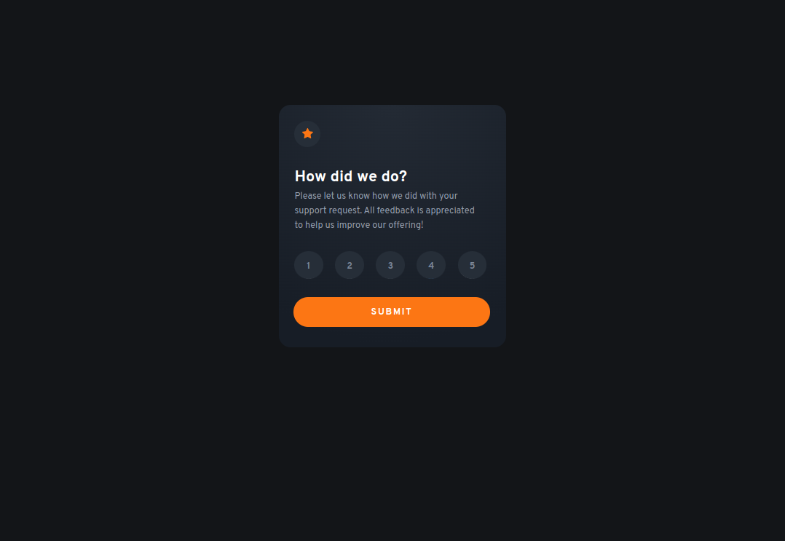
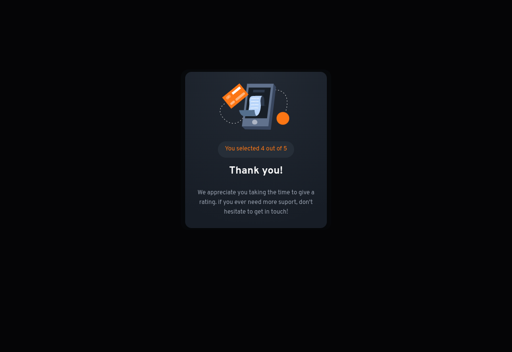
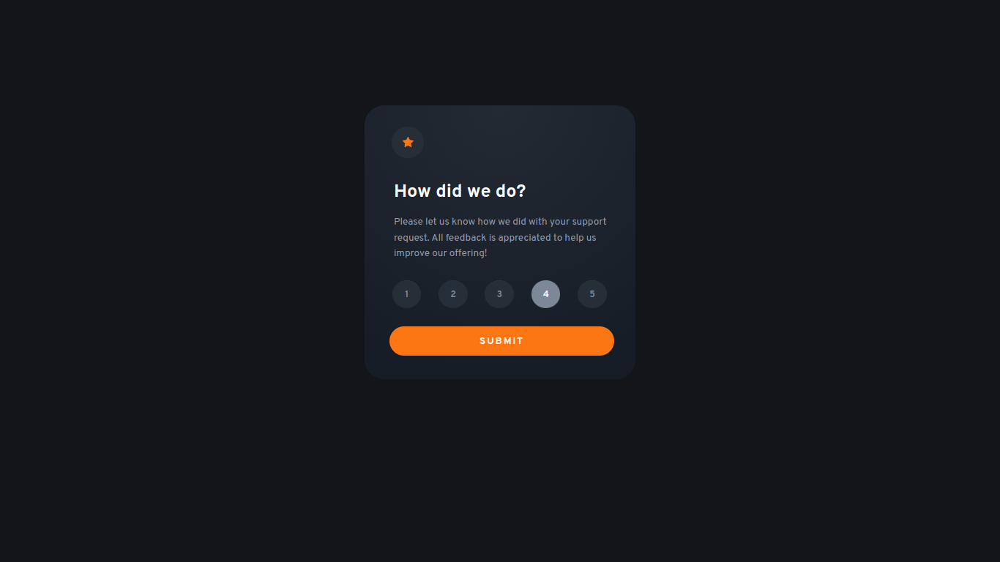
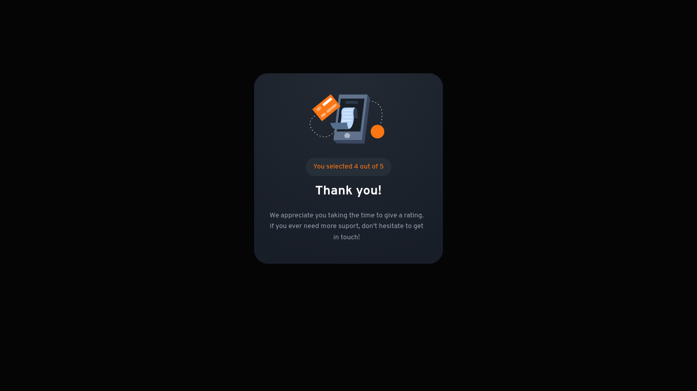

# Frontend Mentor - Interactive rating component solution

This is a solution to the [Interactive rating component challenge on Frontend Mentor](https://www.frontendmentor.io/challenges/interactive-rating-component-koxpeBUmI). Frontend Mentor challenges help you improve your coding skills by building realistic projects. 

## Table of contents

- [Overview](#overview)
- [The challenge](#the-challenge)
- [Screenshot](#screenshot)
- [Links](#links)
- [Built with](#built-with)
- [Author](#author)
- [Acknowledgments](#acknowledgments)

## Overview

### The challenge

Users should be able to:

- View the optimal layout for the app depending on their device's screen size
- See hover states for all interactive elements on the page
- Select and submit a number rating
- See the "Thank you" card state after submitting a rating

### Screenshot

### Mobile

### Desktop

### Links

- [Github](https://github.com/Have-Samuel/Interactive-rating-component)
- [Live Link](https://rating-component1.netlify.app/)

### Built with

- Semantic HTML5 markup
- CSS custom properties
- Flexbox
- Mobile-first workflow
- Javascript
- Git & Gitworkflow

### Useful resources

- [Javascript](https://www.javascripttutorial.net/javascript-dom/javascript-radio-button/) - This helped me for making the selection of the numbers while rating. I really liked this pattern and will use it going forward.
- [Stackoverflow](https://stackoverflow.com/questions/1431726/css-selector-for-a-checked-radio-buttons-label) - This helped me to target the checked buttons. I 

## Author

- [Github](https://github.com/Have-Samuel)
- [@Have-Samuel](https://www.frontendmentor.io/profile/Have-Samuel)
- [@samhave1](https://twitter.com/samhave1)
- [LinkedIn](https://www.linkedin.com/in/have-samuel/)

## 🤝 Contributing

Contributions, issues, and feature requests are welcome!

Feel free to check the [issues page](https://github.com/Have-Samuel/Interactive-rating-component/issues).

## Show your support

Give a ⭐️ if you like this project!

## Acknowledgments

- 🎉 Thanks to Frontend Mentor 
- 👋 Thumbs Up to [@Trekab](https://github.com/trekab)
- etc

## 📝 License

This project is [MIT](./MIT.md) licensed.